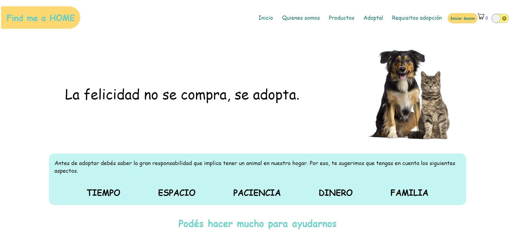

# Proyecto Grupal - Find me a home

  

## Descripción

Es un proyecto con fines voluntarios en el que el usuario puede solicitar la adopción de una mascota rescatada, mediante un contacto con el refugio que cuida del animal.

En esta aplicación, el usuario podrá elegir la mascota de su preferencia buscando en el catálogo a disposición o utilizando filtros, como edad, raza y sexo, para encontrar el animal con características predefinidas. 

Además, el usuario podrá realizar donaciones a los refugios y comprar artículos básicos para mascotas por medio de una plataforma de e-commerce y una pasarela de pagos. Para utilizar estos servicios, será obligatorio registarse en la aplicación.

Por otro lado, el perfil del admin cuenta con un dashboard en el que se registran las ventas del e-commerce y las funcionalidades de agregar, editar y borrar para mascotas, productos y usuarios.

## Tecnologías

- [ ] __Frontend__:
  - HTML
  - CSS
  - JavaScript
  - React / Redux
  - Ant Desing
- [ ] __Backend__:
  - NodeJS
  - Express
  - Sequelize
  - JWT
  - Nodemailer
  - Cloudinary
- [ ] __Base de datos__:
  - Postgres

## Deploy